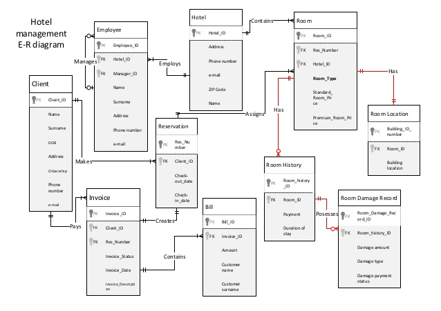

ECM2419 Coursework

# How to set up and use:
#### Installing

1. Unzip the HotelDatabase.zip

   Use MySQL as a database management system.

#### Running

1. Run the Hotel_init.sql to create the tables and insert data in them.
2. Run Hotel_query.sql to see the result of each query.
3. Run Hotel_update.sql ONCE to update the tables.
4. Run Hotel_query.sql again to see the changes in the table.

*  To reset all the data, begin from step 1.

### Hotel_query tasks:
Write an SQL file that will do the following queries:  
   A. How many copies of the books from author George Orwell are owned by each library branch?  
   B. How many copies of the book titled The Lost Tribe are available by the branch St Tomas Library?  
   C. Retrieve the names of all borrowers who haven’t borrowed any book since 01-Jan-2017.  
   D. For each book that is loaned out from the St Tomas Library branch and whose due date is today, retrieve the book title, the borrower’s name and the borrower’s email address.  
   E. Which loaned books of Mr. Ian Cooper are overdue? List the book title, borrowed date, due date. How much fine does Mr. Ian Cooper owe in total?  

### Hotel_update tasks:
Write an SQL file that will do the following:  
   A. Mr. Ian Cooper returned one book titled Pride and Prejudice today.  
   B. Mr Ian Cooper borrowed the novel Animal Farm from St Tomas Library today.  
   C. Add a new book, with 2 copies, one stored in St Tomas Library, one stored in Exeter Library.  
   D. As one copy of the book The Lost Tribe in St Tomas Library is damaged, remove its record from the system.  
   E. As Mr. Ian Cooper has paid for his fine, update his fine to 0.  

## Conceptual Model Design

## Data Requirements
### Hotels
The database must hold records of the hotels. The hotels are identified by their name and
address, however the table should also store unique hotel ID. The system must hold other
information about the hotel like its facilities and public rating in order to help the customer
choose the most suitable hotel. The customer needs a way of contacting hotel, therefore
email and phone number of the hotel must be stored. It is also needed to store the prices and
discount rates for different room types in order to avoid data repetition by storing this
information in room database. Breakfast price is also important information to store in the
database.

### Room
Each hotel contains many rooms of a different type. So, after selecting a specific hotel, the
customers need to select the type of the room they would like to stay in (Single, Double, Twin
or Family). There must be a way to identify the room, as well as its location, therefore room
number must be stored. Room number may include letters in order to identify which building
it is in. For example, room number ‘205 A’ means it is on the second floor in the building ‘A’.
Since the database holds data of different hotels, the room number cannot be used as primary
key, therefore room ID is needed.

### Reservation
The system must keep records of the room reservations, which could be identified by their
unique ID, also used as reservation reference. Reservation record must hold customer ID,
which links the reservation to the customers details. The system must hold the check-in and
check-out dates, which will also be used for identifying which rooms are available during
specific time period. The date of when the reservation was created is important, as it will help
identify the discount eligibility. Customer might travel with other guests and children,
therefore both the numbers needs to be stored. This will be used to both identify the total
breakfast price and needed for security purposes. It is also needed to know which payment
option the customer prefers- pay on arrival or during online booking, pay by cash or card.

### Customer
The customer makes a reservation and his details must be stored in a table for further use.
Each customer is identified by their unique ID, title, first & last name along with their date of
birth. The database should also store customers contact details such as telephone number,
email and address. Since the customer may want to cancel the booking for which he has paid
online, the system should store the credit card number and the expiry date of the card,
however the customer should have the option not to store this information. Card details must
be hashed when moving to a functioning online server to ensure data integrity and must be
encrypted to prevent its corruption.

### AllResservations
Since the customer can make a reservation that might contain multiple rooms, it is essential
to have a separate table that will hold this information in order to avoid data duplication. This
allows linking different rooms to the same reservation reference, allowing the customermake one reservation for separate rooms. For each room there must be a lead guest,
therefore if there are multiple rooms booked, for each room there needs to be lead guest
name specified and stored.

### Invoice
The invoice is issued when the reservation is made and is identified by its unique ID. It also
stores the invoice date and the status of the payment which can be either "Paid", "Awaiting
payment" or "Cancelled". The invoice references to the customer through their customer ID.

# Transaction requirements
### Data Insertion
1 Insert a new reservation that reference the customer and link to the invoice.
2 Insert a new hotel, with its rooms details that are referenced to the hotel.
3 Insert a new customer with specified attributes.

### Data queries
1 Find hotels based on location/price/ parking/rating.
2 Identify the contact details of the hotel.
3 Get customer details.
4 Get reservation information.
5 Check invoice status.
6 Find all available rooms filtered by price/ type.
7 Check the number of ordered breakfasts.
8 Check how many people are staying in the hotel at a certain time period.
9 Check how many rooms are in the hotel for each room type.
10 Check the availability of a room.

### Data Manipulation
1 Update public rating of a hotel.
2 Update the amount of discount for the family rooms.
3 Update invoice status.
4 Update the reservation. Cancel a booking by deleting the reservationID in AllReservations and setting the invoice status to 'Cancelled'.
5 Update room availability
